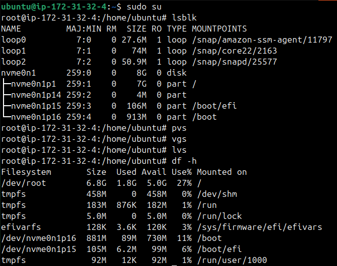
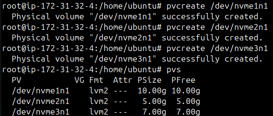
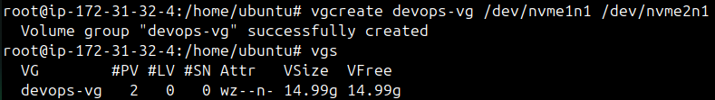
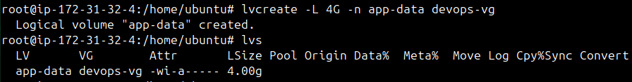
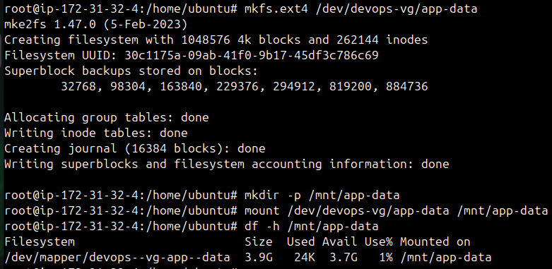
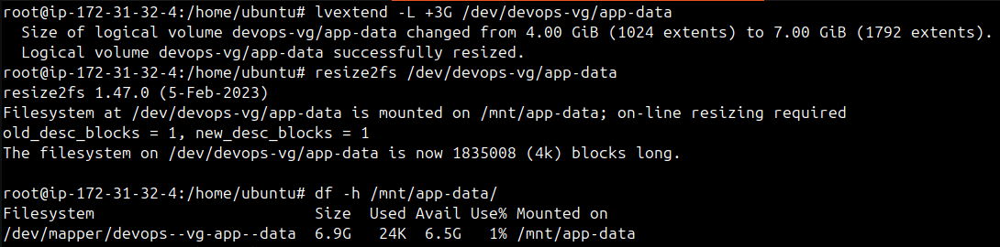
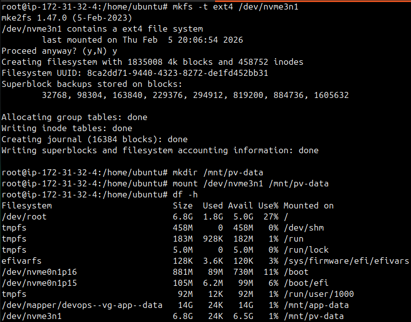

# Day 13 – Linux Volume Management (LVM)

## Task
Learn LVM to manage storage flexibly – create, extend, and mount volumes.

## Task 1: Check Current Storage
Run: `lsblk`, `pvs`, `vgs`, `lvs`, `df -h`

## Task 2: Create Physical Volume

## Task 3: Create Volume Group

## Task 4: Create Logical Volume

## Task 5: Format and Mount

## Task 6: Extend the Volume

## Task 7: Mounting PV directly

## Commands Used

* `lsblk` - List block devices and their mount
* `df -h` - Show mounted filesystem usage
* `pvcreate /dev/sdb` - Initialize partition as PV
* `pvs` - List all PVs
* `vgcreate vg_name /dev/sdb` - Create a VG from PVs
* `vgs` - List all VGs
* `lvcreate -n lv_name -L 5G vg_name` - Create LV of 5GB
* `lvextend -L +2G /dev/vg_name/lv_name` - Extend LV by 2GB
* `lvs` - List all LVs
* `mkfs.ext4 /dev/vg_name/lv_name` - Create ext4 filesystem
* `mount /dev/vg_name/lv_name /mnt/data` - Mount created LV
* `resize2fs /dev/vg_name/lv_name` - Resize ext2/3/4 filesystem
* `mkfs -t ext4 /dev/sdb /mnt/data` - Directly mount PV

## What I learned

- Storage hierarchy in LVM: Physical Volumes (PV) → Volume Groups (VG) → Logical Volumes (LV).

- Flexibility of LVM: Unlike traditional partitions, LVM allows resizing volumes dynamically without downtime.

- Creating and managing PVs: Learned how to initialize raw disks/partitions into physical volumes using pvcreate.

- Grouping storage with VGs: Multiple PVs can be combined into a single Volume Group, making storage management easier.

- Filesystem resizing: After extending an LV, the filesystem (resize2fs) must also be resized to use the new space.

- Mounting volumes: Learned how to format (mkfs.ext4) and mount LVs to directories for actual usage.

- Direct PV mounting: Although possible to mount a PV directly, it’s not recommended — LVM provides abstraction and flexibility.

 
