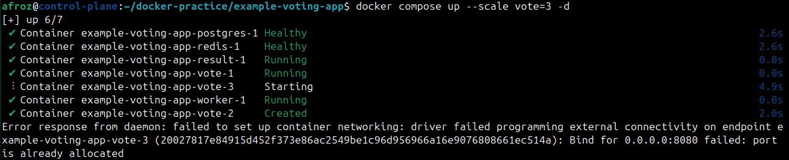
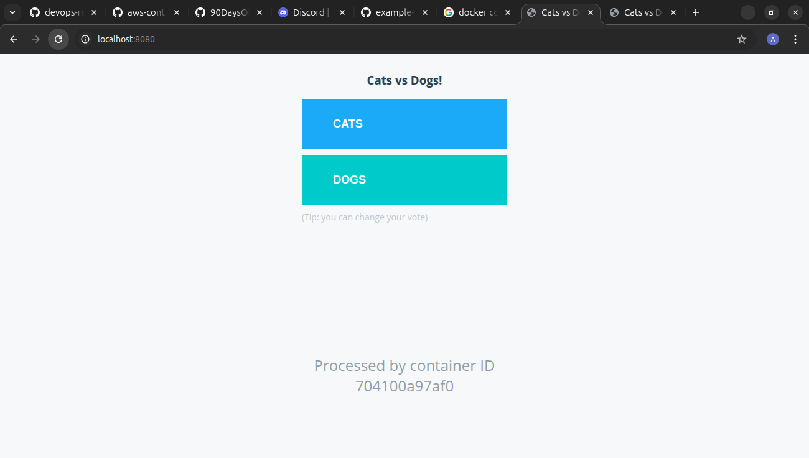
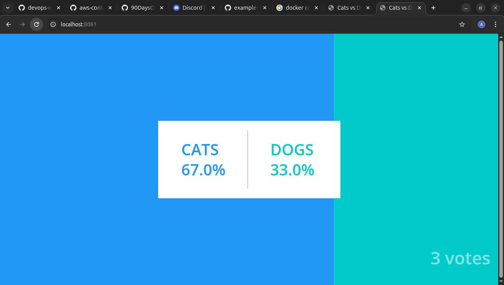

# Day 34 – Docker Compose: Real-World Multi-Container Apps

## Task 1: Build Your Own App Stack
### I have cloned a voting app from GitHub. It contains :
* A front-end web app in Python which lets you vote between two options
* A Redis which collects new votes
* A .NET worker which consumes votes from redis and stores them in db
* A Postgres database backed by a Docker volume
* A Node.js web app which shows the results of the voting in real time

---

## Task 2: depends_on & Healthchecks
* Added all health checks. App does wait for DB to be up.

---

## Task 3: Restart Policies
1. Add `restart: always` to your database service
2. Manually kill the database container — does it come back?
   * Yes. 
3. Try `restart: on-failure` — how is it different?
   * N0
4. Write in your notes: When would you use each restart policy?
   * restart:always: Databases, Backend APIs, Production services, Anything that must always run.
   * restart:on-failure: One-time migration scripts.

---

## Task 4: Custom Dockerfiles in Compose
1. Instead of using a pre-built image for your app, use `build:` in your compose file to build from a Dockerfile
2. Make a code change in your app
3. Rebuild and restart with one command
 
 ### DONE

---

## Task 5: Named Networks & Volumes
1. Define **explicit networks** in your compose file instead of relying on the default
2. Define **named volumes** for database data
3. Add **labels** to your services for better organization

## DONE

---

## Task 6: Scaling (Bonus)
1. Try scaling your web app to 3 replicas using `docker compose up --scale`
2. What happens? What breaks?
3. Write in your notes: Why doesn't simple scaling work with port mapping?

* Docker scale fails, giving error port is already allocated.

   

---

## RESULT

  * All files
   [Voting app project](example-voting-app)
  * Compose file
   [Docker Compose](example-voting-app/docker-compose.yml)

   
   

