# Day 62 -- Providers, Resources and Dependencies

## Task 1: Explore the AWS Provider
1. Create a new project directory: `terraform-aws-infra`
2. Write a `providers.tf` file:
   - Define the `terraform` block with `required_providers` pinning the AWS provider to version `~> 5.0`
   - Define the `provider "aws"` block with your region
3. Run `terraform init` and check the output -- what version was installed?
   * **v5.100.0**

   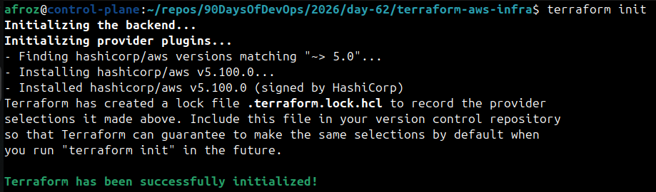

4. Read the provider lock file `.terraform.lock.hcl` -- what does it do?

   * It records providers selections made by terraform init.

   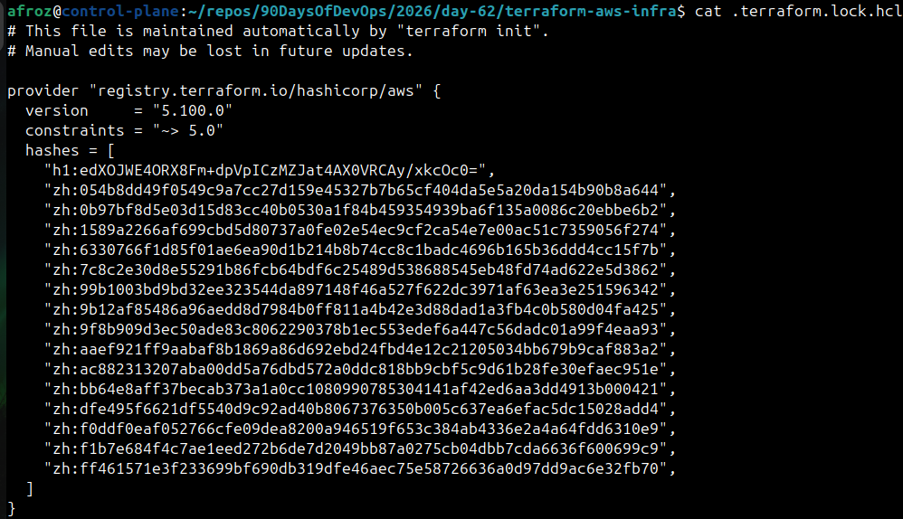

**Document:** What does `~> 5.0` mean? How is it different from `>= 5.0` and `= 5.0.0`?
   * `~> 5.0` - Any version including mjor version 5, from `>= 5.0.0` till `< 6.0.0`, not including anything with version 6.
      - It locks you to the major version 5. Safe upgrades within major version 5.
   * `>= 5.0` - Anything above 5, can include `>6.0.0.` or `>7.0.0`.
      - Less restrictive, may introduce breaking changes if a major upgrade happens.
   * `= 5.0.0` - Only this specific version.
      - No upgrades, no flexibility.

---

## Task 2: Build a VPC from Scratch
Create a `main.tf` and define these resources one by one:

1. `aws_vpc` -- CIDR block `10.0.0.0/16`, tag it `"TerraWeek-VPC"`
2. `aws_subnet` -- CIDR block `10.0.1.0/24`, reference the VPC ID from step 1, enable public IP on launch, tag it `"TerraWeek-Public-Subnet"`
3. `aws_internet_gateway` -- attach it to the VPC
4. `aws_route_table` -- create it in the VPC, add a route for `0.0.0.0/0` pointing to the internet gateway
5. `aws_route_table_association` -- associate the route table with the subnet

Run `terraform plan` -- you should see 5 resources to create.

**Verify:** Apply and check the AWS VPC console. Can you see all five resources connected?

   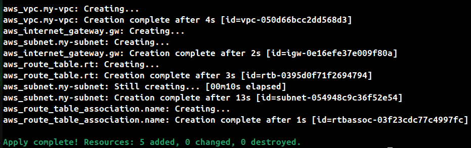

   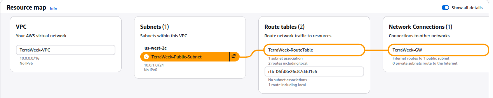

---

## Task 3: Understand Implicit Dependencies
Look at your `main.tf` carefully:

1. The subnet references `aws_vpc.main.id` -- this is an implicit dependency
2. The internet gateway references the VPC ID -- another implicit dependency
3. The route table association references both the route table and the subnet

Answer these questions:
- How does Terraform know to create the VPC before the subnet?
   - Because we referenced `vpc.id` in subnet block terraform knows to create vpc before.

- What would happen if you tried to create the subnet before the VPC existed?
   - AWS reject request giving error `Error: InvalidVpcID.NotFound: The vpc ID 'vpc-xxxx' does not exist`
   - Subnet belongs to a VPC.

- Find all implicit dependencies in your config and list them
   - `my-subnet` : `vpc_id = aws_vpc.my-vpc.id`
   - `gw` : `vpc_id = aws_vpc.my-vpc.id`
   - `rt` : `vpc_id = aws_vpc.my-vpc.id` ,`gateway_id = aws_internet_gateway.gw.id`
   - `rt-association` : `subnet_id = aws_subnet.my-subnet.id` , `route_table_id = aws_route_table.rt.id`

---

## Task 4: Add a Security Group and EC2 Instance
Add to your config:

1. `aws_security_group` in the VPC:
   - Ingress rule: allow SSH (port 22) from `0.0.0.0/0`
   - Ingress rule: allow HTTP (port 80) from `0.0.0.0/0`
   - Egress rule: allow all outbound traffic
   - Tag: `"TerraWeek-SG"`

2. `aws_instance` in the subnet:
   - Use Amazon Linux 2 AMI for your region
   - Instance type: `t2.micro`
   - Associate the security group
   - Set `associate_public_ip_address = true`
   - Tag: `"TerraWeek-Server"`

Apply and verify -- your EC2 instance should have a public IP and be reachable.

   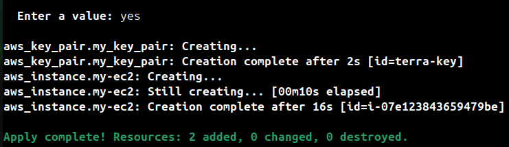

   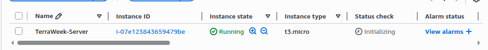

   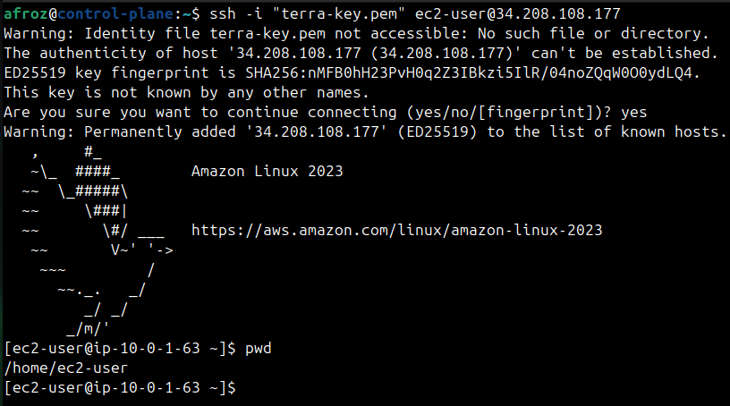

---

## Task 5: Explicit Dependencies with depends_on
Sometimes Terraform cannot detect a dependency automatically.

1. Add a second `aws_s3_bucket` resource for application logs
2. Add `depends_on = [aws_instance.main]` to the S3 bucket -- even though there is no direct reference, you want the bucket created only after the instance
3. Run `terraform plan` and observe the order

   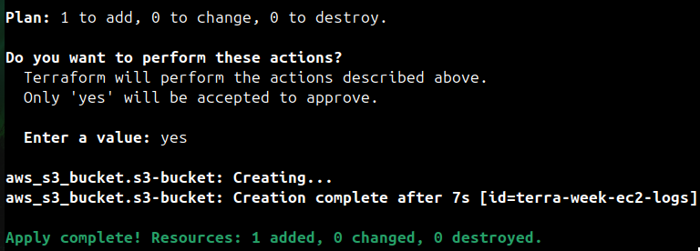

Now visualize the entire dependency tree:
```bash
terraform graph | dot -Tpng > graph.png
```
If you don't have `dot` (Graphviz) installed, use:
```bash
terraform graph
```
and paste the output into an online Graphviz viewer.

   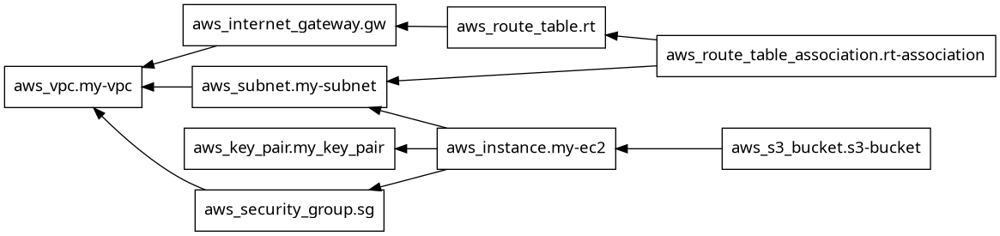

**Document:** When would you use `depends_on` in real projects? Give two examples.
   - 1 - If you configure an EC2 instance to stream logs into an S3 bucket, you must      
         ensure the bucket exists before the EC2 instance starts.
   - 2 - When deploying an application server that connects to a database, you must 
         ensure the DB is provisioned first. Otherwise, the app might launch and fail because the DB endpoint isn’t ready yet.

---

## Task 6: Lifecycle Rules and Destroy
1. Add a `lifecycle` block to your EC2 instance:
```hcl
lifecycle {
  create_before_destroy = true
}
```
2. Change the AMI ID to a different one and run `terraform plan` -- observe that Terraform plans to create the new instance before destroying the old one

   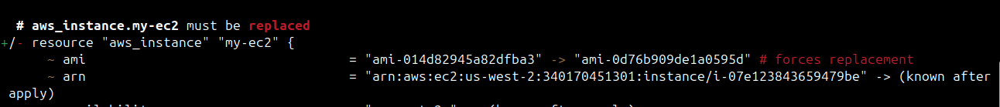

   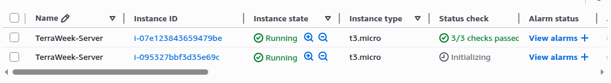

3. Destroy everything:
```bash
terraform destroy
```
4. Watch the destroy order -- Terraform destroys in reverse dependency order. Verify in the AWS console that everything is cleaned up.

   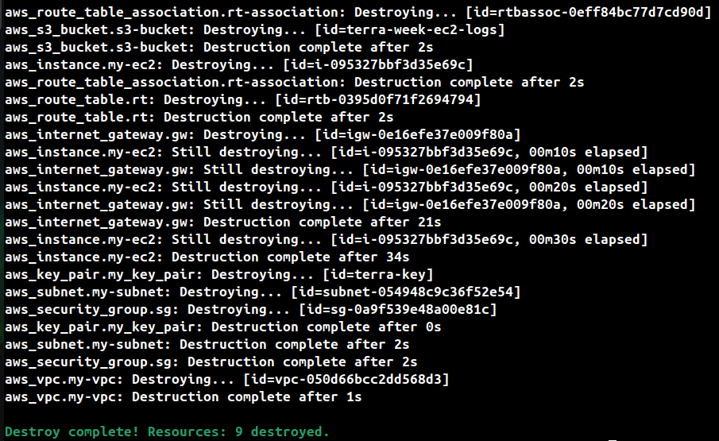

   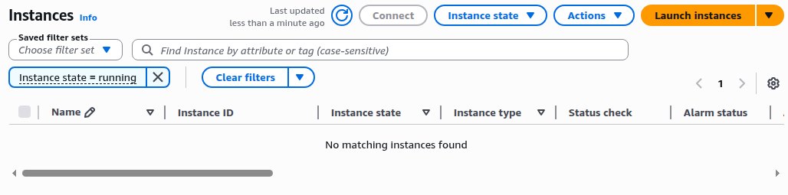

   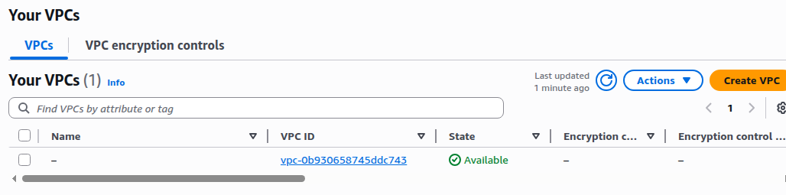

**Document:** What are the three lifecycle arguments (`create_before_destroy`, `prevent_destroy`, `ignore_changes`) and when would you use each?

* **create_before_destroy**
   - Ensures Terraform creates a new resource before destroying the old one.
   - For resources where downtime is unacceptable (e.g., db resources).
* **prevent_destroy**
   - Protects a resource from accidental deletion. Terraform will throw an error if you try to destroy it.
   - For critical resources like production databases, VPCs, or S3 buckets with important data.
* **ignore_changes**
   - Tells Terraform to ignore certain attributes when they drift from the configuration.
   - When manual changes update a resource attribute that you don’t want Terraform to overwrite.

---

- Explanation of implicit vs explicit dependencies in your own words
* **implicit**
   - Resources are referenced inside resource block, terraform know it automatically by
     looking at referenced attribute.
   - For example ec2 instance referencing a security group.
* **explicit**
   - These are dependencies you manually declase using `depends on` when terraform cannot 
     determine it.
   - For example db creation needed before creating an application server.
      

---

